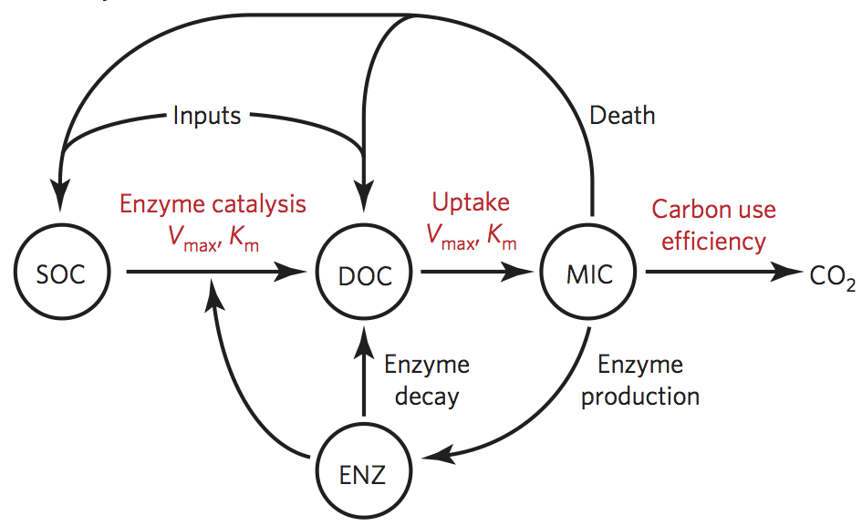

---
output:
  html_document:
    theme: united
---

## Forward Michaelis-Menten model

The forward Michaelis-Menten model is a four compartment model with flows as indicated in the following diagram.

 
_<small>Diagram of forward Michaelis-Menten model (Allison et al. 2010).</small>_

 

### System equations

* Soil organic carbon (SOC) 
    
    $\displaystyle \frac{dS}{dt}  =  IS + FB$

* Dissolved organic carbon (DOC)

    $\displaystyle \frac{dD}{dt} =  ID + FB \times (1 - aBS) + FS + FL - FA$

* Microbial biomass (MIC)

    $\displaystyle \frac{dB}{dt} = FA \times EC(Tref)] - FB - FE$

* Enzyme activity (ENZ)

    $\displaystyle \frac{dE}{dt} = FE - FL$

### Derived quantities

* Uptake

    $\displaystyle FA = \frac{Vup_{tr} \times B \times D}{Kup_{tr} + D}$
    
* Decomposition (flux from SOC to DOC)

    $\displaystyle FS = \frac{V_{tr} \times ES}{K_{tr} + S}$    

* Biomass death

    $\displaystyle FB = rB \times B$

* Enzyme flux

    $\displaystyle FE = rE \times B$

* Enzyme loss 

    $\displaystyle FL = rL \times E$
    
### Functions    
    
* ??? as a function of temperature

    $\displaystyle EC(T) = ECref + m \times (T - 20)$
    
    
### Primitive Quantities    
    
* Reference temperature

    $\displaystyle Tref = 293$

* Input SOC

    $\displaystyle IS$
    
* Input DOC

    $\displaystyle ID$
    
* Proportion of dead microbial mass allocated to SOC pool

    $\displaystyle aBS$    
    
* Proportion of C assimilated into microbial biomass (vs. lost to respiration; i.e. CUE)     

    $ECref$

